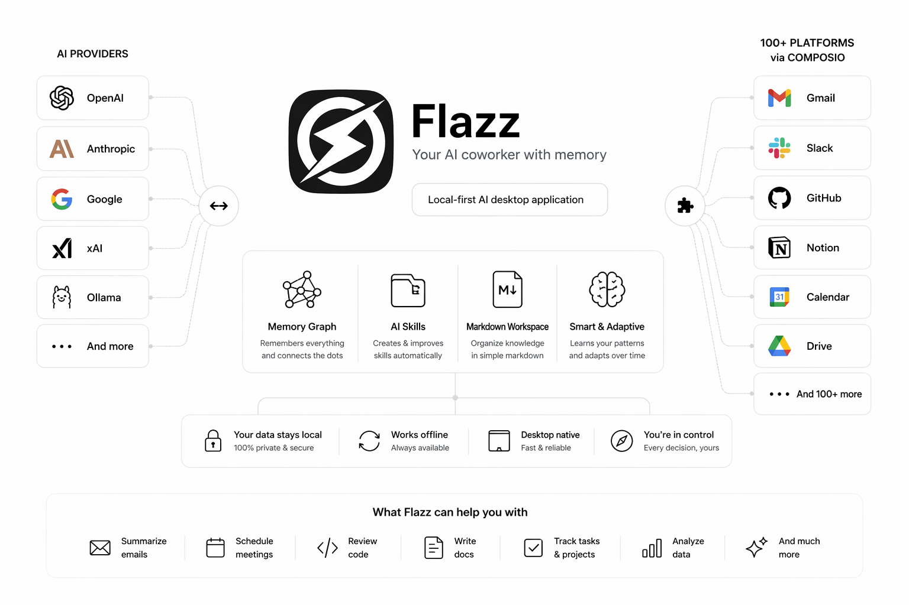
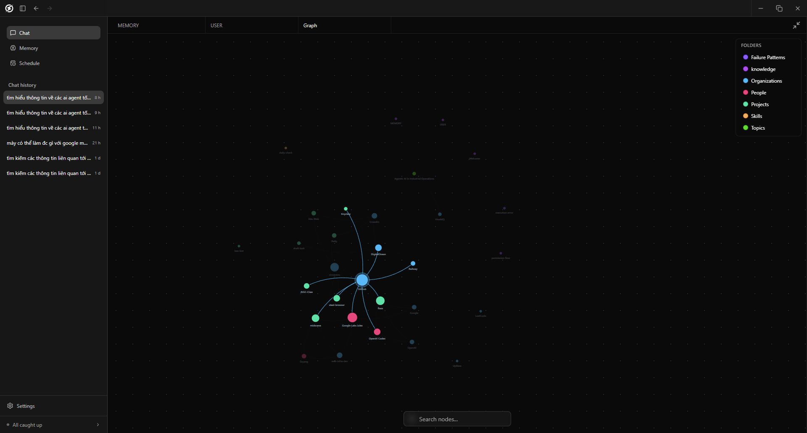
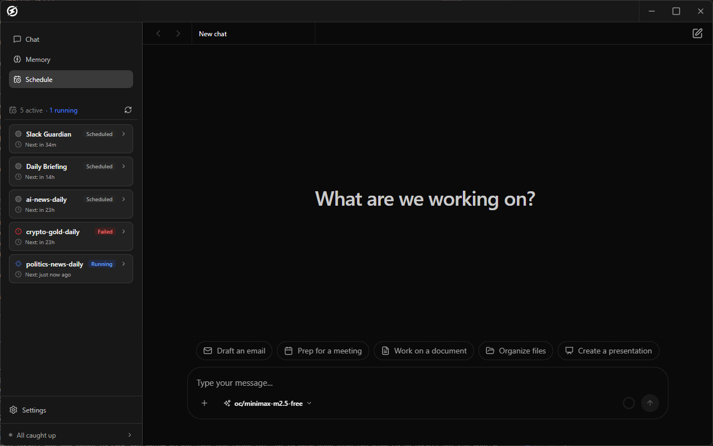

<div align="center">
  
  
  # Flazz
  
  **Your AI coworker with memory**
  
  [](LICENSE)
  [](https://www.typescriptlang.org/)
  [](https://www.electronjs.org/)
  [](https://reactjs.org/)
  
  [Features](#features) • [Quick Start](#quick-start) • [Architecture](#architecture) • [Contributing](#contributing)
</div>

---

## What is Flazz?

Flazz is a **local-first AI desktop application** that acts as your intelligent coworker. Unlike cloud-based AI assistants, Flazz keeps all your data on your machine while providing powerful AI capabilities with **long-term memory**.

<div align="center">
  
</div>

Think of it as your personal AI that:
- **Remembers everything** - Automatically builds a knowledge graph from your emails, meetings, and notes
- **Learns your patterns** - Observes your habits and preferences to provide personalized assistance
- **Creates its own skills** - AI autonomously generates reusable workflows based on your tasks
- **Stays private** - All data lives in `~/Flazz` on your machine
- **Connects to 100+ platforms** - One Composio API key unlocks Gmail, Slack, GitHub, Notion, and more
- **Adapts continuously** - Evolves with your workflow without manual configuration

## Features

### Autonomous Learning & Memory System

Flazz doesn't just store information—it actively learns from your behavior and builds intelligence over time.

**Automatic Knowledge Extraction**
- Processes emails, meetings, voice memos, and documents in the background
- Extracts people, organizations, projects, and topics automatically
- Creates bidirectional wiki-links between related entities
- Builds a navigable knowledge graph like Obsidian, but fully automated

**Behavioral Learning**
- Observes your work patterns and communication style
- Learns which tasks you perform frequently
- Remembers your preferences for tools, formats, and workflows
- Adapts responses based on your past interactions

**Context Retention Across Sessions**
- Maintains conversation history indefinitely
- Recalls details from weeks or months ago
- Connects new information with existing knowledge
- Never forgets important context

**Smart Labeling & Filtering**
- AI-powered categorization of emails and documents
- Automatically filters noise from important information
- Learns what matters to you over time

### Self-Improving AI Skills

Flazz can create and refine its own capabilities without manual programming.

**AI-Generated Skills**
When you perform a task repeatedly, Flazz notices and offers to create a reusable skill:
- "I see you often review pull requests. Should I create a 'PR Review' skill?"
- The AI writes the skill definition, templates, and instructions automatically
- Skills are stored as markdown files you can edit or version control

**Skill Evolution**
- Skills improve based on your feedback
- AI refines prompts and workflows automatically
- Learns from successful vs. unsuccessful executions
- Suggests optimizations and enhancements

**Example: Auto-Generated Code Review Skill**
```markdown
---
name: code-review-assistant
description: Reviews code for security, performance, and best practices
category: development
auto_generated: true
created_from: 5 similar tasks on 2024-03-15
---

# Code Review Assistant

Analyzes code changes and provides:
- Security vulnerability detection
- Performance bottleneck identification
- Best practice recommendations
- Documentation quality assessment

Learned preferences:
- Prefers functional programming patterns
- Focuses on TypeScript strict mode compliance
- Emphasizes test coverage
```

**Skill Library**
- Browse AI-generated and community skills
- Share skills across your team
- Import skills from templates
- Version control with automatic revision history

### Universal Platform Integration via Composio

Connect to 100+ platforms with a single API key—no individual OAuth flows needed.

**One Key, Unlimited Connections**
```bash
# Add your Composio API key once
COMPOSIO_API_KEY=your_key_here

# Instantly access:
- Gmail, Outlook, Yahoo Mail
- Slack, Discord, Microsoft Teams
- GitHub, GitLab, Bitbucket
- Notion, Confluence, Google Docs
- Jira, Linear, Asana, Trello
- Salesforce, HubSpot, Pipedrive
- Google Calendar, Outlook Calendar
- Google Drive, Dropbox, OneDrive
- And 80+ more platforms
```

**Unified Workflow Automation**
- Send emails, create calendar events, update tickets—all from one interface
- AI automatically chooses the right platform based on context
- Cross-platform workflows: "When I get a GitHub PR, notify me in Slack and add to my calendar"

**No OAuth Hassle**
- Traditional approach: Configure OAuth for each service individually
- Flazz + Composio: One API key, instant access to everything
- Composio handles authentication, rate limits, and API changes

**Example Workflows**
```
"Email the team about the deployment" 
→ AI detects you use Gmail, sends via Composio

"Create a ticket for this bug"
→ AI knows your project uses Linear, creates ticket automatically

"Schedule a meeting with Sarah next week"
→ AI checks your Google Calendar, finds free slots, sends invite
```

### Multi-Provider AI Support
Works with all major LLM providers out of the box:
- OpenAI (GPT-4, GPT-4o, o1, o3)
- Anthropic (Claude 3.5 Sonnet, Claude 4)
- Google (Gemini Pro, Gemini Flash)
- xAI (Grok)
- Groq, Mistral, Cohere, DeepSeek, and more
- Local models via Ollama

### Extensible Tool System
- **MCP (Model Context Protocol)** - Connect to any MCP server for custom tools
- **Composio integration** - 100+ platforms with one API key (see above)
- **Built-in tools** - File system, search, git, command execution, and more
- **Custom agents** - Create specialized AI agents for specific domains

### Knowledge Workspace
- **Markdown-first** - All notes are plain markdown files
- **Full-text search** - Fast grep-based search across your workspace
- **Version history** - Git-backed version control for your memory
- **Rich editor** - TipTap-powered markdown editor with live preview

### Privacy & Security
- **100% local-first** - Your data never leaves your machine
- **Workspace sandboxing** - All file operations are scoped to `~/Flazz`
- **Permission system** - Explicit approval for sensitive operations
- **No telemetry** - Optional analytics only

## Quick Start

### Prerequisites
- Node.js 18+ and npm/pnpm
- Git

### Installation

```bash
# Clone the repository
git clone https://github.com/yourusername/flazz.git
cd flazz

# Install dependencies
pnpm install

# Build dependencies
pnpm run deps

# Start development server
pnpm run dev
```

The app will open automatically. Your workspace will be created at `~/Flazz`.

### First Steps

1. **Configure your LLM provider**
   - Open Settings → Models
   - Add your API key for OpenAI, Anthropic, or any supported provider
   - Select your preferred model

2. **Start chatting**
   - Ask questions, request code, or have the AI help with tasks
   - All conversations are saved in your workspace

3. **Connect your data** (optional)
   - Add your Composio API key in Settings → Integrations
   - Instantly connect Gmail, Slack, GitHub, Notion, and 100+ other platforms
   - Set up email sync to build your memory graph automatically
   - Connect calendar for meeting transcripts and scheduling
   - Add voice memos for automatic transcription and knowledge extraction

## Documentation

### Core Concepts

#### Memory Graph
Flazz automatically extracts structured knowledge from your communications:

<div align="center">
  
</div>

```
 Email from Sarah Chen → Creates/updates:
   People/Sarah Chen.md
   Organizations/Acme Corp.md
   Projects/Q1 Integration.md
```

All entities are linked bidirectionally, creating a navigable knowledge graph.

#### Skills

Flazz can create skills automatically or you can define them manually. Skills are reusable AI workflows stored in `~/Flazz/memory/Skills/`.

**AI-Generated Skill Example:**
When you repeatedly perform similar tasks, Flazz offers to create a skill:

```markdown
---
name: meeting-summarizer
description: Summarizes meeting transcripts with action items
category: productivity
auto_generated: true
learned_from: 12 meeting summaries
---

# Meeting Summarizer

Automatically extracts from meeting transcripts:
- Key decisions made
- Action items with owners
- Follow-up questions
- Next meeting topics

Your preferences (learned):
- Prefers bullet points over paragraphs
- Always includes attendee list
- Highlights deadlines in bold
- Sends summary to Slack #team channel
```

**Manual Skill Creation:**
You can also create skills yourself:

```markdown
---
name: code-reviewer
description: Review code for best practices
category: development
---

# Code Reviewer

Review the provided code for:
- Security vulnerabilities
- Performance issues
- Best practices
- Documentation quality

...
```

**Skill Features:**
- Version control with automatic revision history
- Supporting files (templates, scripts, references)
- Shareable across team members
- AI continuously improves skills based on usage

#### Composio Integration

Connect to 100+ platforms with a single API key:

```json
{
  "composio": {
    "apiKey": "your_composio_api_key",
    "enabledApps": [
      "gmail",
      "slack", 
      "github",
      "notion",
      "googlecalendar",
      "linear"
    ]
  }
}
```

**Available Platforms (100+):**
- **Communication:** Gmail, Outlook, Slack, Discord, Teams, Telegram
- **Development:** GitHub, GitLab, Bitbucket, Jira, Linear
- **Productivity:** Notion, Confluence, Google Docs, Asana, Trello
- **CRM:** Salesforce, HubSpot, Pipedrive
- **Calendar:** Google Calendar, Outlook Calendar
- **Storage:** Google Drive, Dropbox, OneDrive
- **And many more...**

**How It Works:**
1. Get a Composio API key from [composio.dev](https://composio.dev)
2. Add it to Flazz settings once
3. AI automatically uses the right platform based on your request
4. No individual OAuth configuration needed

**Example Usage:**
```
You: "Email the team about tomorrow's deployment"
AI: Uses Gmail via Composio to send email

You: "Create a ticket for the login bug"  
AI: Creates issue in your GitHub/Linear/Jira (whichever you use)

You: "Add this to my calendar"
AI: Creates event in Google Calendar via Composio
```

<div align="center">
  
  <p><em>Example: AI automatically scheduling meetings and managing your calendar</em></p>
</div>

### Configuration

Flazz stores configuration in `~/Flazz/.config/`:
- `models.json` - LLM provider settings
- `mcp.json` - MCP server configurations  
- `composio.json` - Composio API key and enabled platforms
- `security.json` - Permission and security settings
- `learning.json` - Behavioral learning preferences and patterns

## Architecture

Flazz follows a clean layered architecture:

```
┌─────────────────────────────────────────┐
│         Renderer (React UI)             │
│  - Chat interface                       │
│  - Knowledge browser                    │
│  - Settings & configuration             │
└─────────────────────────────────────────┘
                  ↕ IPC
┌─────────────────────────────────────────┐
│      Main Process (Electron)            │
│  - Window management                    │
│  - IPC handlers                         │
│  - OAuth flows                          │
└─────────────────────────────────────────┘
                  ↕
┌─────────────────────────────────────────┐
│      Core (Business Logic)              │
│  - Agent runtime                        │
│  - Memory graph                         │
│  - Workspace operations                 │
│  - Integrations (MCP, Composio)         │
└─────────────────────────────────────────┘
                  ↕
┌─────────────────────────────────────────┐
│      Workspace (~/Flazz)                │
│  - memory/                              │
│  - .config/                             │
│  - .trash/                              │
└─────────────────────────────────────────┘
```

### Key Directories

- `apps/renderer` - React frontend
- `apps/main` - Electron main process
- `apps/preload` - Secure IPC bridge
- `packages/core` - Application logic
- `packages/shared` - Shared types and schemas

## Development

### Project Structure

```
flazz/
├── apps/
│   ├── main/          # Electron main process
│   ├── renderer/      # React UI
│   └── preload/       # IPC bridge
├── packages/
│   ├── core/          # Business logic
│   └── shared/        # Shared types
├── assets/            # Icons and images
└── docs/              # Documentation
```

### Available Scripts

```bash
# Development
pnpm run dev           # Start dev server
pnpm run deps          # Build dependencies

# Building
pnpm run build         # Build all packages
cd apps/main && pnpm run make  # Package Electron app for current platform

# Quality
pnpm run lint          # Run ESLint
pnpm run typecheck     # Type check all packages
pnpm run test          # Run tests
```

### Building for Distribution

See [BUILD_AND_RELEASE.md](docs/BUILD_AND_RELEASE.md) for detailed instructions on:
- Building for Windows, macOS, and Linux
- Setting up automated releases via GitHub Actions
- Code signing for Windows and macOS
- Creating installers and portable versions

Quick build for current platform:
```bash
pnpm install
pnpm run deps
cd apps/renderer && pnpm run build
cd ../main && pnpm run build && pnpm run make
```

Output will be in `apps/main/out/make/`

### Adding a New Feature

1. Define contracts in `packages/shared`
2. Implement logic in `packages/core`
3. Add IPC handlers in `apps/main`
4. Build UI in `apps/renderer`

See [AGENTS.md](AGENTS.md) for detailed architecture guidelines.

## Contributing

We welcome contributions! Here's how to get started:

1. **Fork the repository**
2. **Create a feature branch** (`git checkout -b feature/amazing-feature`)
3. **Make your changes** following our architecture guidelines
4. **Run tests and linting** (`pnpm run check`)
5. **Commit your changes** (`git commit -m 'Add amazing feature'`)
6. **Push to your branch** (`git push origin feature/amazing-feature`)
7. **Open a Pull Request**

### Development Guidelines

- Follow the architecture rules in [AGENTS.md](AGENTS.md)
- Keep layer boundaries clean (renderer → main → core)
- Add tests for new features
- Update documentation
- Use conventional commits

### Code of Conduct

- Be respectful and inclusive
- Focus on constructive feedback
- Help others learn and grow

## Security

Security is a top priority. Please review our [Security Policy](.github/SECURITY.md).

**To report a vulnerability**, email `vndt181204@gmail.com` - do not open a public issue.

## License

Flazz is licensed under the [Apache License 2.0](LICENSE).

```
Copyright 2024-2026 Flazz Contributors

Licensed under the Apache License, Version 2.0 (the "License");
you may not use this file except in compliance with the License.
```

## Why Flazz?

### vs. ChatGPT/Claude Web
- **Local-first** - Your data stays on your machine, not on OpenAI/Anthropic servers
- **Long-term memory** - Builds a persistent knowledge graph that grows over time
- **Multi-provider** - Not locked to one LLM provider, switch anytime
- **Extensible** - Add custom tools, skills, and integrations
- **Learns your habits** - Adapts to your workflow automatically
- **100+ platform integrations** - One Composio key vs. no integrations

### vs. Cursor/Copilot
- **General purpose** - Not just for coding, handles emails, meetings, notes, tasks
- **Memory system** - Remembers context across sessions, not just current file
- **Knowledge workspace** - Integrated note-taking and knowledge management
- **Privacy-first** - No code sent to third parties, everything local
- **Auto-generated skills** - AI creates reusable workflows from your patterns
- **Platform integrations** - Connect to Gmail, Slack, Notion, etc.

### vs. Obsidian + AI plugins
- **Native AI integration** - Built from the ground up for AI, not bolted on
- **Automatic knowledge extraction** - No manual note-taking required
- **Agent runtime** - Complex multi-step workflows and tool execution
- **Tool ecosystem** - MCP and Composio integrations out of the box
- **Behavioral learning** - AI learns your preferences and adapts
- **Self-improving** - Creates and refines skills automatically

### vs. Notion AI / Mem.ai
- **100% local** - Your data never leaves your machine
- **Open source** - Full transparency and customization
- **Multi-LLM** - Use any provider, not locked to one
- **Deeper integrations** - Composio enables 100+ platforms vs. limited integrations
- **Skill system** - Reusable workflows that improve over time
- **No subscription** - Pay only for LLM API usage, not the app

## Roadmap

- [ ] Mobile companion app
- [ ] Real-time collaboration
- [ ] Advanced memory search (vector embeddings)
- [ ] Plugin marketplace
- [ ] Cloud sync (optional, encrypted)
- [ ] Voice interface
- [ ] Multi-language support

## Community

- **Issues** - [GitHub Issues](https://github.com/yourusername/flazz/issues)
- **Discussions** - [GitHub Discussions](https://github.com/yourusername/flazz/discussions)
- **Twitter** - [@flazz_ai](https://twitter.com/flazz_ai)

## Acknowledgments

Built with amazing open source projects:
- [Electron](https://www.electronjs.org/) - Cross-platform desktop apps
- [React](https://reactjs.org/) - UI framework
- [Vercel AI SDK](https://sdk.vercel.ai/) - LLM integration
- [TipTap](https://tiptap.dev/) - Rich text editor
- [Radix UI](https://www.radix-ui.com/) - UI primitives
- [Model Context Protocol](https://modelcontextprotocol.io/) - Tool integration standard

---

<div align="center">
  Made with love by the Flazz team
  
  [Star us on GitHub](https://github.com/yourusername/flazz) • [Read the docs](https://github.com/yourusername/flazz/wiki) • [Report a bug](https://github.com/yourusername/flazz/issues)
</div>
